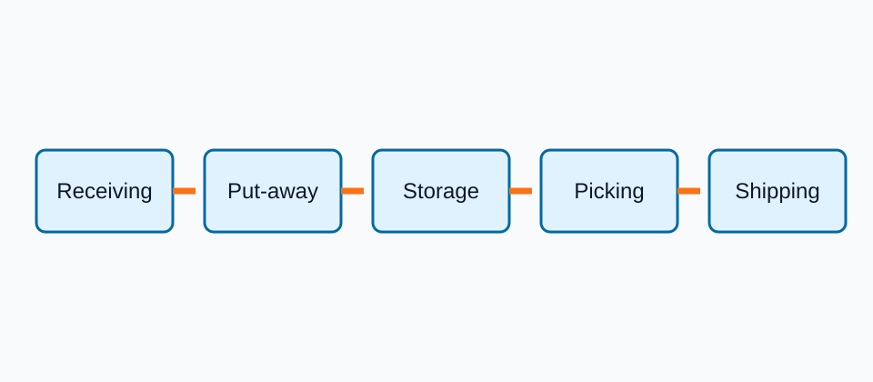

## Captioned figure

{#fig-warehouse-process}

Use the "View full page" control above @fig-warehouse-process.

## Mermaid diagram

```{mermaid}
%%| label: fig-order-flow
%%| fig-cap: Order flow from receipt to shipment.
graph LR
  A["Receive order"] --> B["Allocate stock"]
  B --> C{"Stock available?"}
  C -- "Yes" --> D["Pick and ship"]
  C -- "No" --> E["Create replenishment task"]
```

## Table

| Warehouse process | Main decision | Example measure |
|:--|:--|--:|
| Receiving | Dock assignment | 42 pallets/h |
| Put-away | Storage-location assignment | 38 pallets/h |
| Picking | Batch and route design | 116 lines/h |
| Shipping | Carrier and departure allocation | 51 pallets/h |

: Example warehouse-process measures. {#tbl-process-measures .striped}

## Opt out

{#fig-opt-out .no-full-page}
